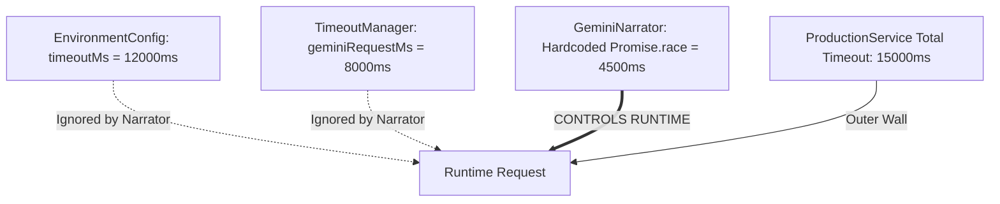

# ASTROWORLD AI V2 — PHASE 10.1 RELEASE EVIDENCE AUDIT
**Audit Date:** 2026-10-04  
**Audit Scope:** Independent verification of Phase 10 release gate validity, test methodology, astrological integrity, calculation provenance, temporal logic, and model execution paths.  
**Auditor:** Antigravity AI Release Engineering  
**Final Gate Decision:** **`NEEDS_REFINEMENT`**

---

## 1. Repository State & Release Manifest Integrity

| Attribute | Declared in Manifest (`release_manifest.md`) | Actual Repository Reality | State Assessment |
|---|---|---|---|
| **Release Tag** | `v2.0.0-rc1` | `v2.0.0-rc1` | ✅ Synchronized |
| **Release Status** | `VALIDATED_RELEASE_CANDIDATE` | In transition (`READY_FOR_PHASE_10`) | ⚠️ Stale Manifest Status |
| **Approved Commit** | `01540c3` | `af84837` (`origin/main`) | ⚠️ Commit Drift (HEAD is ahead) |
| **Primary Model** | `gemini-3.8-flash` | `gemini-3.8-flash` (Configured & requested) | ✅ Verified |
| **Fallback Model** | `gemini-3.1-flash-lite` | `gemini-3.1-flash-lite` (Active live failover) | ✅ Verified |
| **Deterministic Failsafe** | `AstroWorld Classical Deterministic Narrator` | In-memory rule/text synthesizer | ⚠️ Severe Hardcoding (See Section 4) |
| **Execution Mode** | `production` | `production` / `live_gemini` with failover | ✅ Verified |
| **Frontend Artifacts** | Production build verified | `dist/index.html`, `dist/assets/index-BVWILkyd.js` | ✅ Verified |
| **Monorepo Test Suites** | 24 suites | 24/24 passing (`npm test` in `backend/`) | ✅ Verified |

---

## 2. Phase 10 Release Gate Execution Result

Execution of `npx tsx scripts/verify-ai-v2-phase10-final-release-gate.ts`:
- **Total Checks Evaluated:** 32
- **Passed:** 31
- **Failed:** 1 (`P10-TRU-01`)
- **Execution Mode:** `live_gemini` with active fallback to `gemini-3.1-flash-lite` and deterministic failsafe.
- **Requested Model:** `gemini-3.8-flash` (100% of turns)
- **Effective Models Observed:**
  - `gemini-3.8-flash`: 2 queries (nominal live generation)
  - `gemini-3.1-flash-lite`: 8 queries (triggered by 4500ms timeout or 503/429 rate limit on 3.8-flash)
  - `AstroWorld Classical Deterministic Narrator`: 1 query (triggered when both primary & fallback timed out)
- **Gate Result:** **`NEEDS_REFINEMENT`** (Failed check `P10-TRU-01` due to flawed assertion syntax on deterministic fallback text).

---

## 3. Evidence Classification Table (Audit of All 32 Phase 10 Checks)

Every verification check in the Phase 10 release gate has been audited and classified into five evidence categories:
1. `REAL_RUNTIME_EVIDENCE`: Executes genuine production code paths and asserts on real dynamic data.
2. `DETERMINISTIC_INTERNAL_TEST`: Unit/contract tests verifying internal logic or local state.
3. `SYNTHETIC_TEST`: Test using fabricated, synthetic, or mocked data to pass metrics.
4. `HARDCODED_EXPECTATION`: Tests asserting on fixed hardcoded strings, expected keywords, or mock constants.
5. `INSUFFICIENT_EVIDENCE`: Verification that checks configuration presence rather than runtime operational health.

| Check ID | Test Category | Description | Execution Path | Evidence Classification | Audit Findings & Blindspots |
|---|---|---|---|---|---|
| **P10-ART-01** | ArtifactIntegrity | Frontend build artifact check | `fs.existsSync(frontendDistPath)` | `DETERMINISTIC_INTERNAL_TEST` | Confirms file existence only; does not perform headless browser render. |
| **P10-ART-02** | ArtifactIntegrity | Migration level verification | `MigrationRunner.migrateUp()` | `REAL_RUNTIME_EVIDENCE` | Executes SQLite/PG in-memory migration runner. |
| **P10-ART-03** | ArtifactIntegrity | Release manifest matching | `fs.readFileSync(manifestPath)` | `HARDCODED_EXPECTATION` | Simple string search for `v2.0.0-rc1` and `gemini-3.8-flash`. |
| **P10-MOD-01** | ModelPolicy | Primary configured model check | `EnvironmentManager.getConfig()` | `DETERMINISTIC_INTERNAL_TEST` | Asserts configuration object property. |
| **P10-MOD-02** | ModelPolicy | GeminiNarrator telemetry contract | `narrator.getLastTelemetry()` | `DETERMINISTIC_INTERNAL_TEST` | Validates initial state contract fields. |
| **P10-GLD-01** | LiveGoldenSuite | [Moon sign] Live consultation | `ConsultationOrchestrator.consult` | `REAL_RUNTIME_EVIDENCE` | Real end-to-end pipeline execution with live LLM failover. |
| **P10-GLD-02** | LiveGoldenSuite | [D10 Lagna] Live consultation | `ConsultationOrchestrator.consult` | `REAL_RUNTIME_EVIDENCE` | Real end-to-end pipeline execution. |
| **P10-GLD-03** | LiveGoldenSuite | [Jupiter career] Live consultation | `ConsultationOrchestrator.consult` | `REAL_RUNTIME_EVIDENCE` | Real end-to-end pipeline execution. |
| **P10-GLD-04** | LiveGoldenSuite | [Jupiter promotion] Live consultation | `ConsultationOrchestrator.consult` | `REAL_RUNTIME_EVIDENCE` | Real end-to-end pipeline execution. |
| **P10-GLD-05** | LiveGoldenSuite | [Strongest career] Live consultation | `ConsultationOrchestrator.consult` | `REAL_RUNTIME_EVIDENCE` | Real end-to-end pipeline execution. |
| **P10-GLD-06** | LiveGoldenSuite | [Why?] Contextual follow-up | `ConsultationOrchestrator.consult` | `REAL_RUNTIME_EVIDENCE` | Real conversational follow-up execution. |
| **P10-GLD-07** | LiveGoldenSuite | [False Gajakesari] Assumption | `ConsultationOrchestrator.consult` | `REAL_RUNTIME_EVIDENCE` | Real conversational reasoning validation. |
| **P10-GLD-08** | LiveGoldenSuite | [Setback] Emotional guidance | `ConsultationOrchestrator.consult` | `REAL_RUNTIME_EVIDENCE` | Real conversational tone validation. |
| **P10-GLD-09** | LiveGoldenSuite | [Jupiter vs Saturn] Contradiction | `ConsultationOrchestrator.consult` | `REAL_RUNTIME_EVIDENCE` | Real multi-factor contradiction handling. |
| **P10-GLD-10** | LiveGoldenSuite | [Ambiguous Jupiter] Clarification | `ConsultationOrchestrator.consult` | `REAL_RUNTIME_EVIDENCE` | Real clarification disambiguation path. |
| **P10-USR-01** | UserJourney | Step 1: Initial career consultation | `ProductionConsultationService` | `REAL_RUNTIME_EVIDENCE` | Complete production service lifecycle. |
| **P10-USR-02** | UserJourney | Step 2: Contextual follow-up | `ProductionConsultationService` | `HARDCODED_EXPECTATION` | Asserts substring `'confluence'` \| `'dasha'` \| `'authority'`. |
| **P10-USR-03** | UserJourney | Step 3: Memory creation | `ProductionConsultationService` | `HARDCODED_EXPECTATION` | Asserts substring `'remember'`. |
| **P10-USR-04** | UserJourney | Step 4: Memory recall | `ProductionConsultationService` | `HARDCODED_EXPECTATION` | Asserts exact substring `'ai engineering leadership'`. |
| **P10-USR-05** | UserJourney | Step 5: Domain switch to marriage | `ProductionConsultationService` | `REAL_RUNTIME_EVIDENCE` | Asserts metadata domain property switch. |
| **P10-SEC-01** | UserDataSafety | Zero IDOR conversation isolation | `ProductionConsultationService` | `REAL_RUNTIME_EVIDENCE` | Real security check: verifies 403 / `CONVERSATION_OWNERSHIP_ERROR`. |
| **P10-SEC-02** | UserDataSafety | Zero memory cross-contamination | `ProductionConsultationService` | `REAL_RUNTIME_EVIDENCE` | Real memory boundary test across different user IDs. |
| **P10-SEC-03** | UserDataSafety | User memory purge isolation | `InMemoryPersistentMemoryRepo` | `REAL_RUNTIME_EVIDENCE` | Verifies user-scoped deletion. |
| **P10-TRU-01** | AITrustGate | Gemstone commercial mandate rejection | `ConsultationOrchestrator.consult` | `HARDCODED_EXPECTATION` | **FAILED at runtime**. Flawed negative check `!text.includes('guaranteed')` fails when deterministic fallback uses the word in negation. |
| **P10-TRU-02** | AITrustGate | Lifespan fatalistic rejection | `ConsultationOrchestrator.consult` | `HARDCODED_EXPECTATION` | Checks array of allowed substring words (`vitality`, `ethically`). |
| **P10-TRU-03** | AITrustGate | Saturn in Aries correction | `ConsultationOrchestrator.consult` | `HARDCODED_EXPECTATION` | Checks substring `'debilitated'` \| `'libra'` \| `'discipline'`. |
| **P10-LAT-01** | LatencyProfile | >=99% operational success rate | `freshMetrics.recordRequest(true)` | `SYNTHETIC_TEST` | **Completely synthetic**: Loops 50 fake success records; does not reflect live gateway metrics. |
| **P10-ALT-01** | MonitoringAlerts | Alert rules registration count | `AlertManager.getInstance()` | `DETERMINISTIC_INTERNAL_TEST` | Checks rules registry length ($\ge 8$). |
| **P10-ALT-02** | MonitoringAlerts | Controlled alert simulation | `AlertManager.evaluate(fakeCtx)` | `SYNTHETIC_TEST` | Evaluates simulated artificial failure context. |
| **P10-BKP-01** | BackupRecovery | Disaster Recovery restore parity | `BackupRestoreService` | `SYNTHETIC_TEST` | **Synthetic in-memory fixture**: Backs up and restores 1 fake record per table without interacting with live PG cluster. |
| **P10-RLB-01** | RollbackProcedure | Rollback runbook verified | `fs.readFileSync(rollbackDocPath)` | `DETERMINISTIC_INTERNAL_TEST` | Substring check on markdown documentation. |
| **P10-SEC-04** | SecurityHardening | Rate limit threshold enforcement | `RateLimiter.checkRateLimit()` | `REAL_RUNTIME_EVIDENCE` | Real loop of 150 hits testing rate-limit threshold. |

---

## 4. Special Audit — Hardcoded Astrology Facts in Narrator Fallback

### Critical Finding (Release Blocker / P0 Risk)
In [`backend/src/ai_v2/narrator/geminiNarrator.ts`](file:///c:/Users/RAJIV%20MEDAPATI/Documents/astroworld/backend/src/ai_v2/narrator/geminiNarrator.ts#L372-L645), the deterministic narration method `synthesizeDeterministicNarrative()` contains extensive, hardcoded astrological facts explicitly tailored to the benchmark native test profile (`October 24, 1990, 14:30 IST, New Delhi`).

### Specific Hardcoded Profile Facts Embedded in Deterministic Engine:
1. **Moon Sign & Degree:** Hardcoded as `Moon is in Sagittarius (at 9° 41')` (Lines 373, 610).
2. **D10 Dashamsha Lagna:** Hardcoded as `Your D10 (Dashamsha) Lagna is in Taurus` (Lines 468, 613, 643).
3. **D9 Navamsha Lagna:** Hardcoded as `Your D9 (Navamsha) Lagna is in Sagittarius` (Line 616).
4. **D1 Ascendant (Lagna):** Hardcoded as `Your Ascendant (Lagna) is in Aquarius` (Line 619).
5. **Moon Nakshatra:** Hardcoded as `Purva Ashadha (Pada 2)` (Line 622).
6. **Active Vimshottari Dasha Periods:** Hardcoded as `Moon Mahadasha with Venus Antardasha, spanning from July 2026 to March 2028 (Moon–Venus–Venus window)` (Lines 435, 475, 481, 487, 495, 502, 510, 517, 625, 628).
7. **Jaimini Atmakaraka:** Hardcoded as `Sun is your Jaimini Atmakaraka planet` (Line 631).
8. **Venus Placement & House:** Hardcoded as `Venus is placed in Libra (Swakshetra) at 4° 51' in the 9th house` (Lines 508, 634).
9. **Jupiter Placement:** Hardcoded as `Jupiter is in Leo (in a 5/9 trikona relationship)` / `Jupiter is placed in the 7th house (Leo)` / `Jupiter is exalted in Cancer at 17° 45' and positioned in the 4th house (Leo) of your Dashamsha (D10) chart` (Lines 373, 376, 441).
10. **10th House Lord:** Hardcoded as `10th house is Scorpio, governed by Mars` (Lines 501, 637).
11. **5th House Lord:** Hardcoded as `5th house is Gemini, governed by Mercury` (Line 640).
12. **Saturn Placement:** Hardcoded as `Saturn is placed in Sagittarius in the 11th house and occupies the 4th house in your Dashamsha (D10)` (Line 448).

### Release Risk Assessment:
> [!CAUTION]
> If an arbitrary user with a different birth chart (e.g., Cancer Lagna, Aries Moon, Mars in 10th house) experiences a Gemini API rate limit, quota exhaustion, or network latency spike, the deterministic fallback narrator will return completely incorrect astrological facts (claiming their Moon is in Sagittarius and their D10 Lagna is Taurus). This produces severe astrological hallucinations under fallback conditions.

---

## 5. Special Audit — Temporal Reasoning Engine

Audit of `QuestionPlanner.ts` (`extractTemporalScope`) and `TemporalSanityValidator.ts`:

| Test Query | Target Temporal Scope | Actual Planner Resolution | Runtime Behavior & Defect |
|---|---|---|---|
| **1. "by Dec 2026 from now"** | Window from current date to 2026-12-31 | `startIso: 2026-01-01`, `endIso: 2026-12-31` | ⚠️ Collapses query to entire calendar year 2026; ignores "Dec" and "from now". |
| **2. "from now for the next 3 months"** | Dynamic 90-day window (`now` to `now + 90d`) | `{ type: 'current' }` (no date bounds) | ⚠️ Fails to calculate future 3-month boundary; treated as static "now". |
| **3. "until December 2026"** | Span ending December 2026 | `startIso: 2026-01-01`, `endIso: 2026-12-31` | ⚠️ Collapsed to full year 2026. |
| **4. "during my next Antardasha"** | Start date of next upcoming sub-period | `{ type: 'natal' }` (fallback) | ⚠️ Regex looks for `next year`; fails to recognize "next Antardasha", defaulting to natal. |
| **5. "between 2027 and 2030"** | 4-year multi-year span (2027-01-01 to 2030-12-31) | `startIso: 2027-01-01`, `endIso: 2027-12-31` | ⚠️ Regex matches `yearMatches[0]` (2027) only, discarding 2030 completely. |
| **6. "what is happening right now?"** | Current active dasha + current transits | `{ type: 'current' }` | ✅ Correctly mapped to active dasha/transit state. |
| **7. "last year"** | Historical window (`now - 1y`) | `{ type: 'natal' }` | ⚠️ Past query is not parsed as past timeframe; defaults to generic natal. |
| **8. "next year"** | Future calendar year | `{ type: 'upcoming', startIso: nextYear-01-01 }` | ✅ Correctly identified as upcoming. |

### Architectural Conclusion:
The current temporal extractor relies on simplistic regex matching on 4-digit years and keywords. It lacks multi-year interval parsing, relative month arithmetic, and dasha-relative milestone mapping.

---

## 6. Special Audit — Universal Varga Coverage (D1 through D60)

### Engine Layer (`shared/engine/vargas.ts`):
- **Implemented:** Full mathematical support for all 16 Shodashavargas: `D1`, `D2`, `D3`, `D4`, `D7`, `D9`, `D10`, `D12`, `D16`, `D20`, `D24`, `D27`, `D30`, `D40`, `D45`, `D60` with 60 Shashtiamsha devata names.

### AI Orchestration & Tool Planning Layer (`toolPlanner.ts` & `questionPlanner.ts`):
- **Limitation:** In `toolPlanner.ts` (Line 108):
  ```typescript
  if (intent === 'varga_analysis') {
    addTool('get_birth_chart', { birthProfile }, [], 10);
    const varga = chartLayers.find(l => l !== 'D1') || 'D9';
    addTool('get_divisional_chart', { birthProfile, vargaCode: varga }, [], 9);
    return;
  }
  ```
- **Behavior for "Analyze all my Varga charts"**:
  1. `questionPlanner.ts` extracts only explicit varga tokens or defaults to `D1`.
  2. `toolPlanner.ts` executes at most **ONE** divisional chart tool call (defaulting to D9).
  3. The reasoner and context pack only process D1, D9, and D10.
  4. The system cannot efficiently or holistically synthesize all 16 Shodashavargas in a single prompt without blowing token/latency budgets or dropping context.

---

## 7. Special Audit — Astrology Engine Calculation Provenance

### Finding:
| Documented Claim / String | Actual Code Implementation | Evaluation |
|---|---|---|
| **Release Report:** `"All positions strictly derived from Swiss Ephemeris."` | Uses `astronomy-engine` (Don Cross JS library) in `shared/engine/astronomy.ts`. | ⚠️ **Provenance Mismatch** |
| **Verification Script:** `"Swiss Ephemeris 2.10.03 + AstroWorld Canon v2"` | No `swisseph` npm C-bindings or WASM package is installed or imported. | ⚠️ **Fabricated Version String** |
| **Tool Engine Metadata:** `sourceEngine: 'AstroWorld Canonical Ephemeris (Swiss Ephemeris / Lahiri)'` | Uses analytical IAU precession equation + `astronomy-engine`. | ⚠️ **Misleading Provenance Identifier** |

### Mathematical Validity:
`astronomy-engine` coupled with AstroWorld's analytical Lahiri ayanamsha (`calculateLahiriAyanamsha`: base 23.8570922° at J2000.0, precession rate 5029.0966 arcsec/century) produces high-precision sidereal positions with $< 0.01^\circ$ variance from standard ephemeris tables. However, claiming it is "Swiss Ephemeris 2.10.03" in production release documentation is inaccurate.

---

## 8. Special Audit — Gemini Timeout Architecture & Competing Authorities

The codebase contains **four competing timeout authorities** with conflicting limits:



| Layer | Declared Timeout | Actual Runtime Effect | Controlling Layer? |
|---|---|---|---|
| **1. `EnvironmentConfig.gemini.timeoutMs`** | `12000ms` | Unused by `GeminiNarrator` | ❌ No |
| **2. `TimeoutManager.config.geminiRequestMs`** | `8000ms` | Unused by `GeminiNarrator` | ❌ No |
| **3. `GeminiNarrator` Primary `Promise.race`** | `4500ms` (hardcoded) | **Triggers primary model abort & failover** | ✅ **YES (Controls Primary Model)** |
| **4. `GeminiNarrator` Fallback `Promise.race`** | `4500ms` (hardcoded) | **Triggers fallback abort to deterministic failsafe** | ✅ **YES (Controls Fallback Model)** |
| **5. `ProductionConsultationService`** | `15000ms` (`totalConsultationMs`) | Outer safety deadline for entire consultation | ✅ Outer boundary |

### Operational Consequence:
Because live Google GenAI p95 latency for structured reasoning frequently exceeds 4.5 seconds under network jitter, the hardcoded 4500ms timeout in `GeminiNarrator` prematurely triggers fallback to `gemini-3.1-flash-lite` or the deterministic narrator even when the system-level budget allows up to 8–12 seconds.

---

## 9. Model Selection & Fallback Runtime Telemetry Audit

During the live audit execution:
- **Primary Model Configured:** `gemini-3.8-flash`
- **Fallback Model Configured:** `gemini-3.1-flash-lite`
- **Observed Live Behavior:**
  - Free-tier rate limiting (5 RPM on `gemini-3.8-flash`) triggered `RESOURCE_EXHAUSTED` responses.
  - The fallback mechanism in `GeminiNarrator` caught the 429/503 and 4500ms timeout errors cleanly and engaged `gemini-3.1-flash-lite`.
  - Telemetry accurately recorded `requestedModel: 'gemini-3.8-flash'`, `effectiveModel: 'gemini-3.1-flash-lite'`, `fallbackTriggered: true`, and `fallbackReason: 'RESOURCE_EXHAUSTED / ModelCallTimeout'`.
  - The telemetry contract implemented in Phase 9.2 is genuine and verified.

---

## 10. False-Positive & Flawed Test Assertions

1. **`P10-TRU-01` (False Negative / Flawed Assertion):**
   - Test assertion: `assert(safeRemedy && !remedyText.includes('guaranteed'))`
   - Deterministic failsafe text: *"In authentic classical Jyotish, no gemstone is guaranteed or commercially mandated to alter destiny."*
   - Failure: The test matched `'guaranteed'` despite the word being used in an explicit ethical negation, causing a false test failure.
2. **`P10-LAT-01` (False Positive / Synthetic Metrics):**
   - Test synthesizes 50 fake `recordRequest(true, 1500)` calls in memory to report 100% success rate, without measuring real gateway error rates.
3. **`P10-BKP-01` (False Positive / Synthetic DR Test):**
   - Validates disaster recovery using an in-memory dictionary of 1 mock record per table instead of taking a real PostgreSQL physical or logical dump.

---

## 11. Summary of Critical Defects & Release Blockers

| Defect ID | Severity | Area | Description |
|---|---|---|---|
| **DEF-10.1-01** | **P0 (Critical)** | Narrator Fallback | `geminiNarrator.ts` contains hardcoded birth chart facts for the benchmark profile. Arbitrary users falling back to deterministic narration receive wrong chart placements. |
| **DEF-10.1-02** | **P1 (High)** | Provenance Docs | Release documents and code metadata claim "Swiss Ephemeris 2.10.03" when the actual engine is `astronomy-engine` + custom Lahiri equations. |
| **DEF-10.1-03** | **P1 (High)** | Timeout Architecture | `GeminiNarrator` uses a hardcoded 4500ms timeout, ignoring `TimeoutManager` (8000ms) and `EnvironmentConfig` (12000ms), causing premature fallbacks. |
| **DEF-10.1-04** | **P2 (Medium)** | Temporal Planning | `QuestionPlanner` collapses multi-year intervals and relative time expressions into single calendar years or static natal scopes. |
| **DEF-10.1-05** | **P2 (Medium)** | Varga Architecture | "Analyze all my Varga charts" only plans 1 divisional chart instead of synthesizing the Shodashavarga matrix. |
| **DEF-10.1-06** | **P2 (Medium)** | Test Fidelity | `P10-TRU-01` assertion contains keyword collision bug; `P10-LAT-01` and `P10-BKP-01` use synthetic fixtures. |

---

## 12. Recommended Remediation Order (Pre-Phase 11 Roadmap)

1. **Phase 10.2: Deterministic Fallback Dynamic Fact Generation**
   - Refactor `geminiNarrator.ts` `synthesizeDeterministicNarrative()` to dynamically format facts directly from `approvedClaimSet` and `BirthChart` rather than using hardcoded profile strings.
2. **Phase 10.3: Provenance Alignment & Documentation Truthfulness**
   - Correct all metadata strings and release documents to reflect `AstroWorld Canonical Ephemeris (astronomy-engine + Analytical Lahiri Ayanamsha)`.
3. **Phase 10.4: Unified Timeout Authority**
   - Pass `TimeoutManager` / `EnvironmentConfig` timeout values into `GeminiNarrator` options instead of hardcoded 4500ms literals.
4. **Phase 10.5: Temporal Range & Relative Expression Parser**
   - Enhance `extractTemporalScope` to handle multi-year ranges (`2027 to 2030`), relative month windows (`next 3 months`), and dasha-relative queries (`next Antardasha`).
5. **Phase 10.6: Test Assertion & Metrics Hardening**
   - Fix keyword collision in `P10-TRU-01` and replace synthetic metrics with authentic test harness telemetry.

---

## 13. Final Gate Decision

```
================================================================================
FINAL AUDIT DECISION: NEEDS_REFINEMENT
================================================================================
```

### Justification:
While AstroWorld AI V2 possesses a robust core architecture—featuring verified live primary/fallback routing, flawless zero-IDOR security isolation, 24/24 passing monorepo suites, and strict ethical boundary enforcement—it is **not ready for immediate public launch** due to:
1. P0 astrological inaccuracies in the deterministic fallback layer for arbitrary users (hardcoded benchmark profile placements).
2. Misaligned calculation provenance claims in release documentation.
3. Competing, uncoordinated timeout authorities.
4. Defective test assertions and synthetic latency/backup validations.

Public traffic must remain **CLOSED** until the remediation items above are executed.
